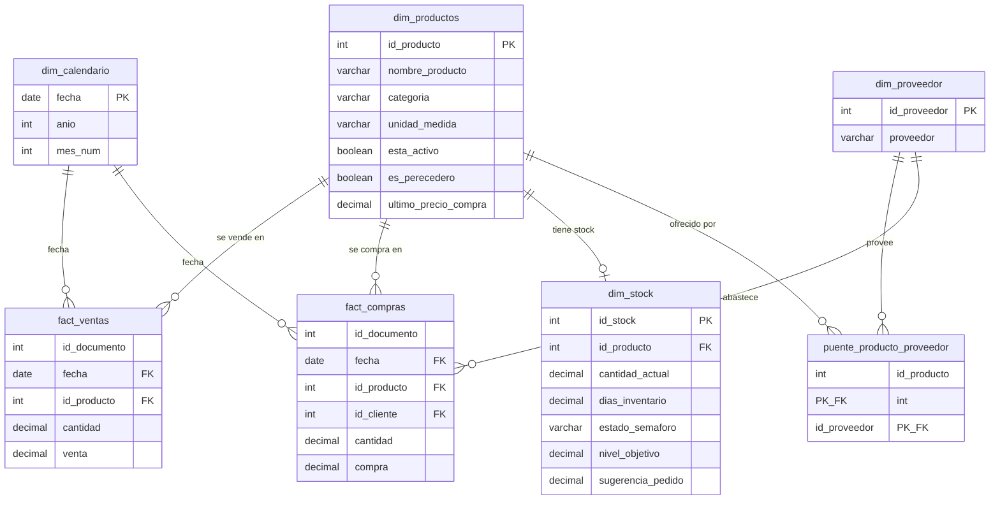

# 2. Arquitectura de Datos — Modelo Estrella

Modelo dimensional (Dim/Fact) que alimenta el motor de sugerencia de pedidos. La capa de negocio se
materializa en archivos `.parquet` desde una arquitectura **medallón** (bronze → plata → oro).

---

## 2.1 Tablas y tipos de datos

### `dim_productos` — Catálogo maestro de productos
| Columna | Tipo | Descripción |
|---------|------|-------------|
| **id_producto** | `INT` (PK) | Identificador único |
| nombre_producto | `VARCHAR` | Nombre comercial |
| categoria | `VARCHAR` | Categoría base (Res, Fruver, Ahumados…) |
| categoria_nivel_2 | `VARCHAR` | Línea de control normalizada |
| categoria_nivel_3 | `VARCHAR` | Sub-línea / producto base |
| unidad_medida | `VARCHAR` | `'kg'` o `'uni'` |
| precio_venta | `DECIMAL(12,2)` | Precio al público |
| costo_estandar | `DECIMAL(12,2)` | Costo estándar |
| ultimo_precio_compra | `DECIMAL(12,2)` | Última compra registrada |
| margen_ganancia | `DECIMAL(6,2)` | % de margen |
| esta_activo | `BOOLEAN` | Producto activo en catálogo |
| **es_perecedero** | `BOOLEAN` | Define la ventana de cálculo (14 vs 90 días) |
| frecuencia_inventario | `VARCHAR` | `Semanal` / `Mensual` |
| fecha_creacion_prod | `TIMESTAMP` | Alta del producto |

### `dim_proveedor` — Maestro de proveedores
| Columna | Tipo | Descripción |
|---------|------|-------------|
| **id_proveedor** | `INT` (PK) | Identificador del proveedor |
| proveedor | `VARCHAR` | Nombre del proveedor |

### `puente_producto_proveedor` — Tabla puente (resuelve M:N)
| Columna | Tipo | Descripción |
|---------|------|-------------|
| **id_producto** | `INT` (PK, FK → dim_productos) | |
| **id_proveedor** | `INT` (PK, FK → dim_proveedor) | |

> Un producto puede comprarse a **varios** proveedores y un proveedor vende **muchos** productos.
> La relación muchos-a-muchos se modela aquí (PK compuesta).

### `dim_stock` — Estado de inventario + motor de sugerencia
| Columna | Tipo | Descripción |
|---------|------|-------------|
| **id_stock** | `INT` (PK) | |
| id_producto | `INT` (FK → dim_productos) | |
| id_bodega | `INT` | Bodega/punto |
| cantidad_actual | `DECIMAL(12,3)` | Stock disponible (decimal para kg) |
| fecha_u_venta | `DATE` | Última venta |
| dias_sin_vender | `INT` | Recencia comercial |
| costo_estandar | `DECIMAL(12,2)` | Costo para valorizar |
| capital_en_riesgo | `DECIMAL(14,2)` | `cantidad_actual × costo` |
| venta_diaria_referencia | `DECIMAL(12,4)` | Venta diaria según ventana |
| **dias_inventario** | `DECIMAL(8,2)` | `stock ÷ venta diaria` |
| **estado_semaforo** | `VARCHAR` | `CRÍTICO` / `NORMAL` / `ESTANCADO` |
| **nivel_objetivo** | `DECIMAL(12,3)` | `VD × (7 + colchón)` |
| sugerencia_pedido | `DECIMAL(12,3)` | `max(0, nivel_objetivo − stock)` |

### `fact_ventas` — Hechos de venta *(grano: línea documento-producto)*
| Columna | Tipo | Descripción |
|---------|------|-------------|
| id_documento | `INT` | Documento de venta |
| numero_documento | `VARCHAR` | Folio |
| fecha | `DATE` (FK → dim_calendario) | |
| id_producto | `INT` (FK → dim_productos) | |
| id_cliente | `INT` | Cliente |
| id_usuario | `INT` | Cajero |
| cantidad | `DECIMAL(12,3)` | Unidades o kg |
| precio_unitario | `DECIMAL(12,2)` | |
| costo_producto | `DECIMAL(12,2)` | |
| venta | `DECIMAL(14,2)` | Importe de la línea |

### `fact_compras` — Hechos de compra *(grano: línea de compra)*
| Columna | Tipo | Descripción |
|---------|------|-------------|
| id_documento | `INT` | Documento de compra |
| numero_documento | `VARCHAR` | Folio |
| fecha | `DATE` (FK → dim_calendario) | |
| id_producto | `INT` (FK → dim_productos) | |
| id_cliente | `INT` (FK → dim_proveedor) | El proveedor que vendió |
| cantidad | `DECIMAL(12,3)` | |
| precio_unitario | `DECIMAL(12,2)` | |
| costo_producto | `DECIMAL(12,2)` | |
| compra | `DECIMAL(14,2)` | Importe de la línea |

---

## 2.2 Diagrama DBML (para [dbdiagram.io](https://dbdiagram.io))

```dbml
Table dim_productos {
  id_producto           int          [pk]
  nombre_producto       varchar
  categoria             varchar
  categoria_nivel_2     varchar
  categoria_nivel_3     varchar
  unidad_medida         varchar      [note: "'kg' | 'uni'"]
  precio_venta          decimal
  costo_estandar        decimal
  ultimo_precio_compra  decimal
  margen_ganancia       decimal
  esta_activo           boolean
  es_perecedero         boolean
  frecuencia_inventario varchar
  fecha_creacion_prod   timestamp
}

Table dim_proveedor {
  id_proveedor int       [pk]
  proveedor    varchar
}

Table puente_producto_proveedor {
  id_producto  int [ref: > dim_productos.id_producto]
  id_proveedor int [ref: > dim_proveedor.id_proveedor]

  indexes {
    (id_producto, id_proveedor) [pk]
  }
}

Table dim_stock {
  id_stock                int       [pk]
  id_producto             int       [ref: > dim_productos.id_producto]
  id_bodega               int
  cantidad_actual         decimal
  fecha_u_venta           date
  dias_sin_vender         int
  costo_estandar          decimal
  capital_en_riesgo       decimal
  venta_diaria_referencia decimal
  dias_inventario         decimal
  estado_semaforo         varchar
  nivel_objetivo          decimal
  sugerencia_pedido       decimal
}

Table dim_calendario {
  fecha          date [pk]
  anio           int
  mes_num        int
  dia_semana_num int
}

Table fact_ventas {
  id_documento     int
  numero_documento varchar
  fecha            date [ref: > dim_calendario.fecha]
  id_producto      int  [ref: > dim_productos.id_producto]
  id_cliente       int
  id_usuario       int
  cantidad         decimal
  precio_unitario  decimal
  costo_producto   decimal
  venta            decimal
}

Table fact_compras {
  id_documento     int
  numero_documento varchar
  fecha            date [ref: > dim_calendario.fecha]
  id_producto      int  [ref: > dim_productos.id_producto]
  id_cliente       int  [ref: > dim_proveedor.id_proveedor, note: "proveedor"]
  cantidad         decimal
  precio_unitario  decimal
  costo_producto   decimal
  compra           decimal
}
```

---

## 2.3 Diagrama Entidad-Relación (Mermaid — renderiza en GitHub / Obsidian)



---

## 2.4 Nota de modelado — corrección de la relación proveedor

En el estado previo el proveedor colgaba directo del producto, lo que impedía representar que **un
producto se compra a varios proveedores**. Se corrige con la tabla puente
`puente_producto_proveedor`, que resuelve la relación **muchos-a-muchos**:

`dim_proveedor (1) ──< puente_producto_proveedor >── (1) dim_productos`

> ⚠️ *Deuda técnica conocida (backlog):* en la fuente existen proveedores duplicados (mismo proveedor con
> nombres distintos por errores de captura de distintos cajeros). Se corregirá en origen; no bloquea el MVP.
