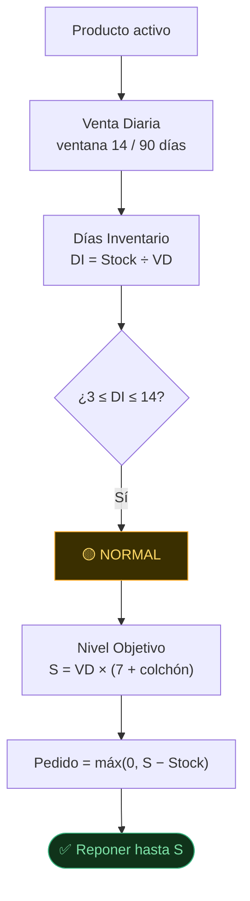
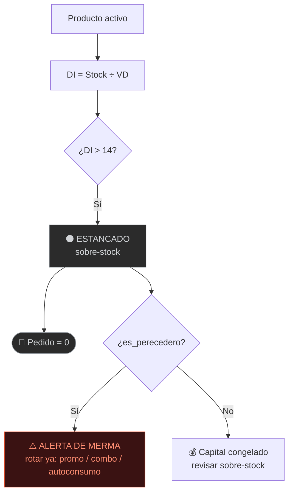
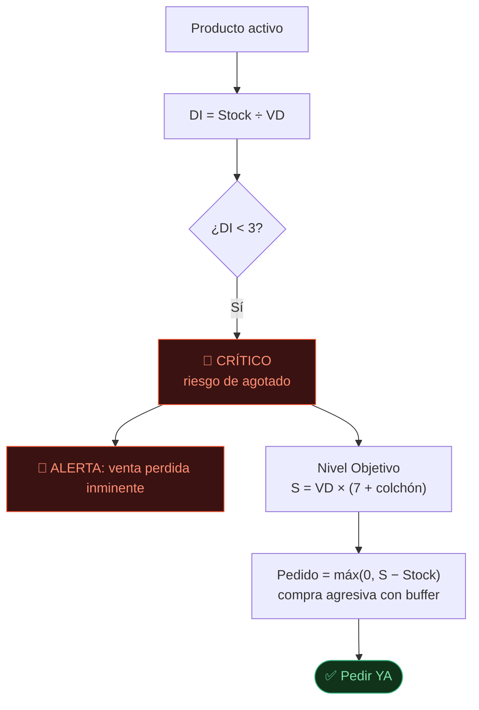

# 3. Lógica de Negocio — El Motor Analítico

Modelo de **revisión periódica (*order-up-to*)**: como el proveedor pasa cada 7 días, no reponemos "lo
vendido", sino que **llenamos hasta un nivel objetivo** que cubre el ciclo + un colchón de seguridad.

---

## 3.1 Fórmulas clave

**1. Venta Diaria** — total vendido en la ventana ÷ *todos* los días de la ventana (incluidos los días en cero):

$$VD = \frac{\sum cantidad_{ventana}}{N_{dias}} \qquad N_{dias} \in \{14,\ 90\}$$

**2. Días de Inventario** — cuántos días dura el stock actual:

$$DI = \frac{Stock_{actual}}{VD}$$

**3. Nivel Objetivo (S)** — cuánto deberíamos tener para llegar al próximo pedido:

$$S = VD \times (7 + colch\acute{o}n)$$

**4. Sugerido de Compra** — el hueco hasta el nivel objetivo, nunca negativo:

$$Pedido = \max(0,\ S - Stock_{actual})$$

---

## 3.2 Reglas de criterio

**Ventana de cálculo** (regla senior: *más perecedero → ventana más corta*):

| Tipo | `es_perecedero` | Ventana ($N$) | Por qué |
|------|-----------------|---------------|---------|
| Perecedero (Carnes, Fruver, Lácteos…) | `True` | **14 días** | Mira el presente; se daña rápido |
| Estable (Abarrotes, Aseo, Bebidas…) | `False` | **90 días** | Mira la historia; demanda estable |

**Colchón de seguridad** (días extra sobre el ciclo de 7):

| Tipo | Colchón |
|------|---------|
| Verdura muy perecedera | **+1,5 días** |
| Carne / perecedero | **+2 días** |
| No perecedero | **+3 días** |

**Semáforo de decisión:**

| Estado | Condición | Acción |
|--------|-----------|--------|
| 🔴 **CRÍTICO** | $DI < 3$ | Alerta urgente → compra agresiva |
| 🟡 **NORMAL** | $3 \le DI \le 14$ | Completar hasta el nivel objetivo |
| ⚫ **ESTANCADO** | $DI > 14$ | Pedido = 0 (+ alerta de merma si es perecedero) |

---

## 3.3 Escenarios de decisión (flujos visuales)

### Escenario 1 — 🟡 Rotación Normal (reponer hasta el nivel objetivo)

### Escenario 2 — ⚫ Producto Estancado / "Hueso" (no pedir + alerta de merma)

### Escenario 3 — 🔴 Producto Crítico / Agotado (alerta urgente + compra agresiva)

---

## 3.4 Ejemplos con datos reales (corte 2026-06-06)

| Producto | Stock | VD | DI | $S$ | Pedido | Escenario |
|----------|-------|----|----|-----|--------|-----------|
| **Costilla Ahumada** | 2,94 kg | 3,03 kg/d | **1,0** | 27,3 kg | **≈24 kg** | 🔴 CRÍTICO — pedir ya |
| **Plátano Maduro** | 42,8 kg | 5,37 kg/d | 8,0 | 48,3 kg | **≈5,5 kg** | 🟡 NORMAL — reponer hasta $S$ |
| **Cadera Especial** | 7,75 kg | 0,81 kg/d | 9,6 | 7,3 kg | **0 kg** | 🟡 NORMAL — ya cubierto |
| **Yuca** | 13,16 kg | 0,22 kg/d | **60,6** | 1,8 kg | **0 kg** | ⚫ ESTANCADO ⚠️ merma |

> Los cuatro casos cubren toda la casuística:
> - **Costilla Ahumada:** vende 14/14 días con stock para <1 día → pedido agresivo (24 kg).
> - **Plátano Maduro:** rota bien y tiene 42,8 kg, pero el objetivo es 48,3 → se **repone el hueco** (≈5,5 kg).
>   *(Este es el caso típico "tengo 20, mi objetivo es 50, pido 30".)*
> - **Cadera Especial:** está dentro de rango y ya supera su objetivo → **no se pide** (evita sobre-stock).
> - **Yuca:** 60 días de inventario en un perecedero que no dura 15 → no pedir y rotar antes de que se pierda.
